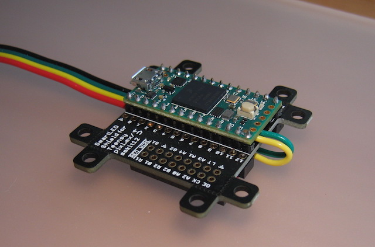
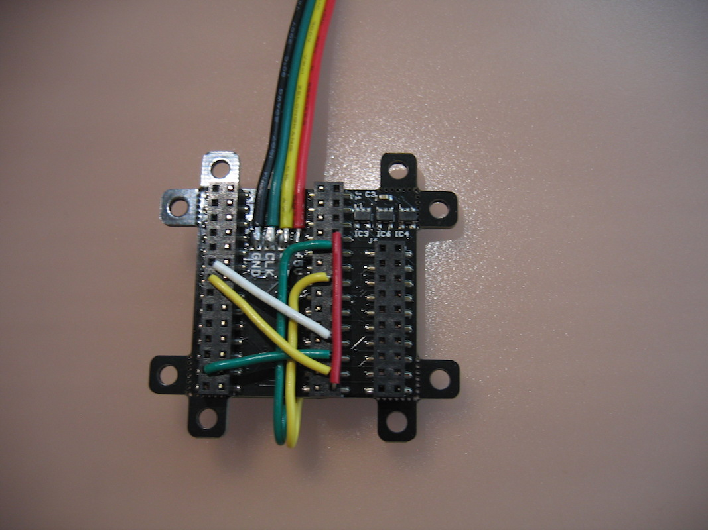

# ledMatrixDemo_t4
Proof of concept LED Matrix driver for Teensy 4.0

This arduino sketch enables a Teensy 4.0 to drive a [32x64 LED matrix panel](https://www.sparkfun.com/products/14718) in full color using the Pixelmatix SmartLED Shield V4 as an interface.

The panel driver uses hardware features of the Teensy 4.0 and SmartLED Shield to drive the panel with near zero CPU overhead. It uses the FlexIO and FlexPWM peripherals together with Direct Memory Access (DMA) to push pixel data to the panel thousands of times per second. In theory, most of the full capabilities of the SmartMatrix library could be ported over to Teensy 4.0 using this technique.

In order to get it set up, you need to make some modifications to the Teensy: two jumper wires must be soldered to pins 32 (yellow) and 33 (green) on the underside of the board before inserting it into the SmartLED Shield. Additionally, there are 4 more jumper wires which must be inserted into the SmartLED shield sockets. Wire together pins 10 & 14, 2 & 12, 11 & 20, 9 & 21, 5 & 32, and 3 & 33. See the image below.

Once up and running, you can adjust `latchesPerRow` to change the color bit depth. At 1 bit, the panel can only display fully saturated colors (red, green, blue, magenta, cyan, yellow, white). Good truecolor requires at least 8 bits. Up to 16 bits are possible.

